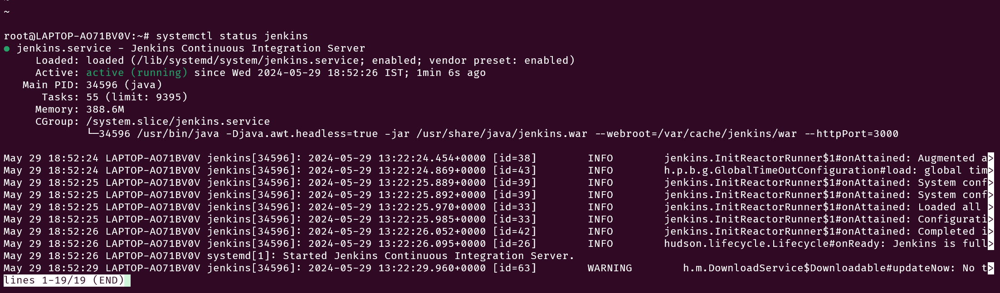
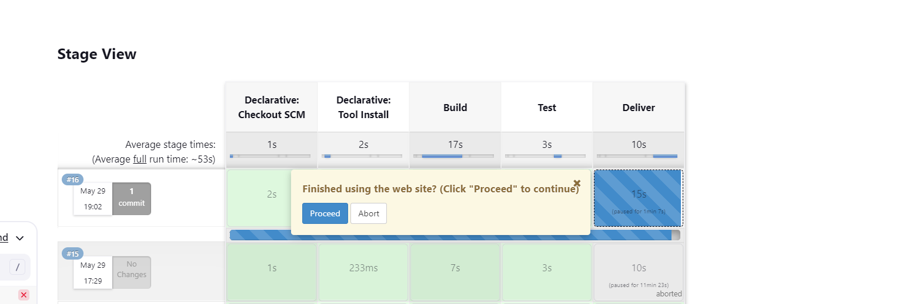
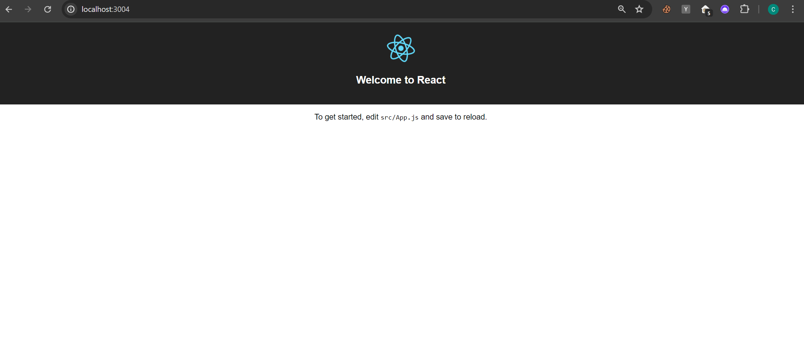
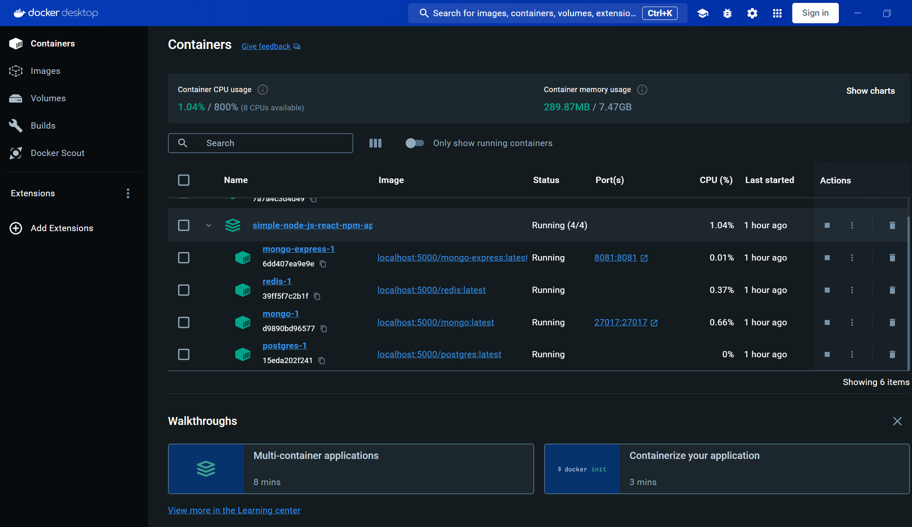
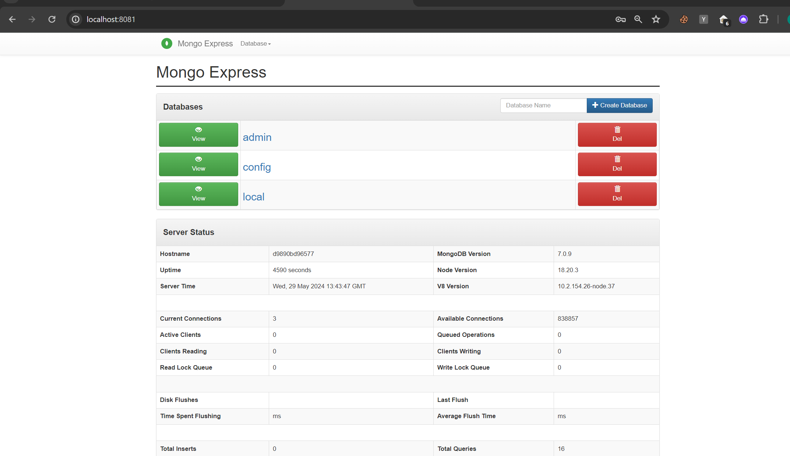
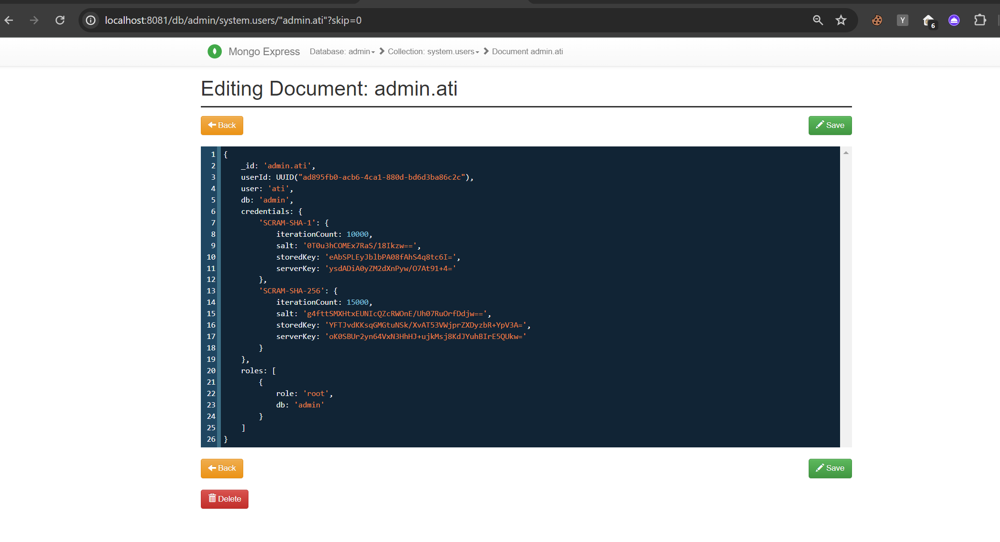

# Assignment 1
# Jenkins Pipeline Configuration

## Overview
- This document outlines the Jenkins pipeline configuration for a Node.js application. The pipeline includes three stages: Build, Test, and Deliver. 
- It is designed to run on port 3004, and the Jenkins service has been configured accordingly in `/lib/systemd/system/jenkins.service` and `/etc/default/jenkins`.

## Prerequisites
- Jenkins installed and running on port 3004.
- Node.js and npm installed on the Jenkins server.
- Global Tool Configuration in Jenkins set up with Node.js named "NODEJS".

## Starting Jenkins

To start Jenkins, use the following command:

```sudo systemctl start jenkins```
  

To check the status, use the following command

```sudo systemctl status jenkins```



Here, we can see the Jenkins is running on port ```3000```

## Pipeline Stages

### Build
The build stage installs the necessary npm packages for the project.


### Test
The test stage executes the test.sh script located in the jenkins/scripts directory to run the project’s tests.

```groovy
stage('Test') {
    steps {
        sh './jenkins/scripts/test.sh'
    }
}
```

### Deliver
The deliver stage performs the following actions:

- Executes the deliver.sh script to deploy the application.
- Waits for user input to proceed, ensuring manual approval before moving forward.
- Runs the kill.sh script to clean up any processes after delivery.

```groovy
stage('Deliver') { 
    steps {
        sh './jenkins/scripts/deliver.sh' 
        input message: 'Finished using the web site? (Click "Proceed" to continue)' 
        sh './jenkins/scripts/kill.sh' 
    }
}
```

### Verification

The pipline serve the server on 3004



The nodejs app is running on port ```3004```




# Assignment 2
## Docker Setup Guide

Follow these steps to push images to a local Docker registry 

### Step 1: Set Up a Local Docker Registry
Run a local registry container:

```bash
docker run -d -p 5000:5000 --name registry registry:2
```

### Step 2: Tag Your Images
Tag your images to point to your local registry:

```bash
docker tag postgres:latest localhost:5000/postgres:latest
docker tag redis:latest localhost:5000/redis:latest
docker tag mongo:latest localhost:5000/mongo:latest
docker tag mongo-express:latest localhost:5000/mongo-express:latest
```

### Step 3: Push the Images
Push the images to your local registry:

```bash
docker push localhost:5000/postgres:latest
docker push localhost:5000/redis:latest
docker push localhost:5000/mongo:latest
docker push localhost:5000/mongo-express:latest
```
# Docker Compose Setup

This Docker Compose file sets up a local development environment with the following services:

## Services

### Postgres
- **Image**: `localhost:5000/postgres:latest` - This is the Postgres database image pulled from the local registry.
- **Environment Variables**:
  - `POSTGRES_USER`: The username for the Postgres database.
  - `POSTGRES_PASSWORD`: The password for the Postgres database.

### Redis
- **Image**: `localhost:5000/redis:latest` - This is the Redis image pulled from the local registry.

### Mongo
- **Image**: `localhost:5000/mongo:latest` - This is the MongoDB image pulled from the local registry.
- **Environment Variables**:
  - `MONGO_INITDB_ROOT_USERNAME`: The root username for MongoDB.
  - `MONGO_INITDB_ROOT_PASSWORD`: The root password for MongoDB.
- **Ports**:
  - `27017:27017` - This maps port 27017 of the host to port 27017 of the container, allowing access to the MongoDB service.

### Mongo-Express
- **Image**: `localhost:5000/mongo-express:latest` - This is the Mongo-Express web interface image pulled from the local registry.
- **Environment Variables**:
  - `ME_CONFIG_MONGODB_ADMINUSERNAME`: The admin username for Mongo-Express.
  - `ME_CONFIG_MONGODB_ADMINPASSWORD`: The admin password for Mongo-Express.
  - `ME_CONFIG_MONGODB_SERVER`: The MongoDB server that Mongo-Express should connect to.
- **Ports**:
  - `8081:8081` - This maps port 8081 of the host to port 8081 of the container, allowing access to the Mongo-Express web interface.
- **Depends On**:
  - `mongo` - This ensures that the Mongo-Express service starts only after the MongoDB service is up and running.

## Usage

To start the services, run the following command in the directory containing the `docker-compose.yml` file:

```bash
docker-compose up -d
```

## Verification

All the local images are pulled from local registry




Mongo express is connected to MongoDB



The database is using the ```ati``` credentials


